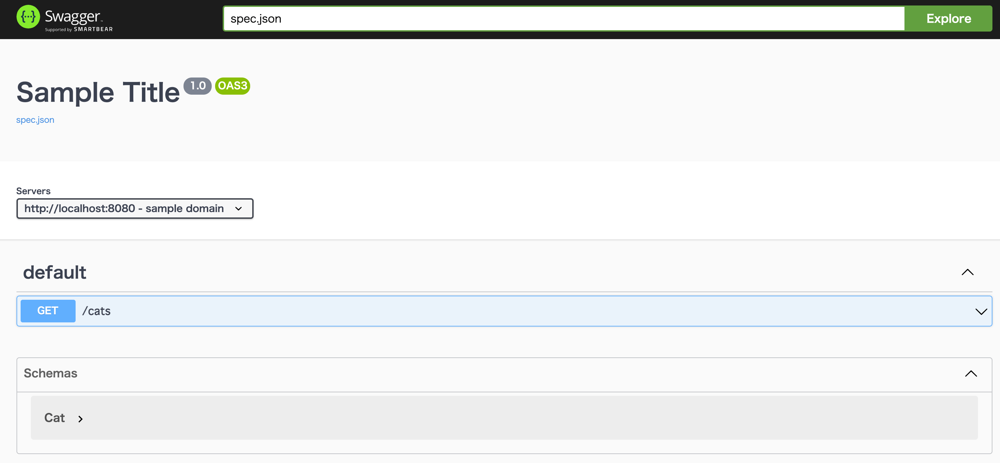

# openapi-tutorial

openapi に慣れるための練習リポジトリ

# Requirements

以下が必要です。

- Docker
- Docker Compose

Dockerのインストール方法は[こちら](https://docs.docker.com/get-docker/)

# Get started

1. envファイル作成

```
$ cp .env.example .env
```
ポートを変えたい場合は適宜ファイル中の`PORT`を書き換える.

2. dockerコンテナを立ち上げる
```
$ docker-compose up -d
```

3. localhost:{PORT} にアクセス

<p align="center">
  
</p>

4. 色々触ってみる

[こちら](https://swagger.io/specification/)を参考に色々とAPIの定義を書いて練習しましょう.

`./docs/spec.json` を編集し、ブラウザをリロードすると変更が反映されます。

# Recommend extensions for VsCode users

## [OpenAPI (Swagger) Editor](ttps://marketplace.visualstudio.com/items?itemName=42Crunch.vscode-openapi)

IntelliSenseを提供してくれるのでOpenAPIの仕様を覚えなくても楽に描けるようになります.